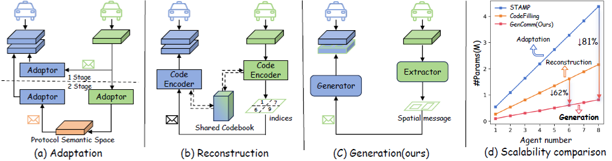
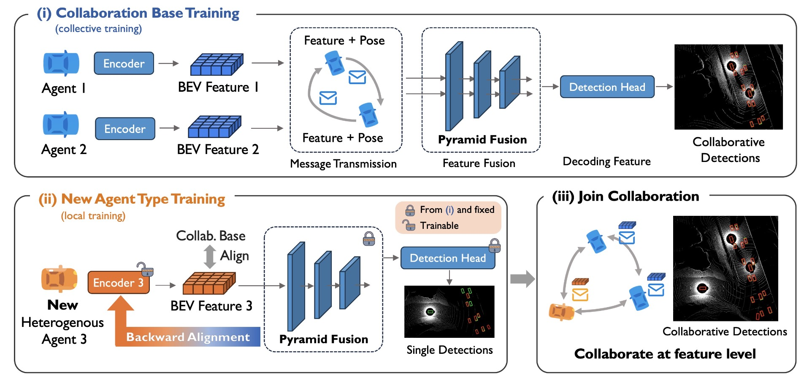
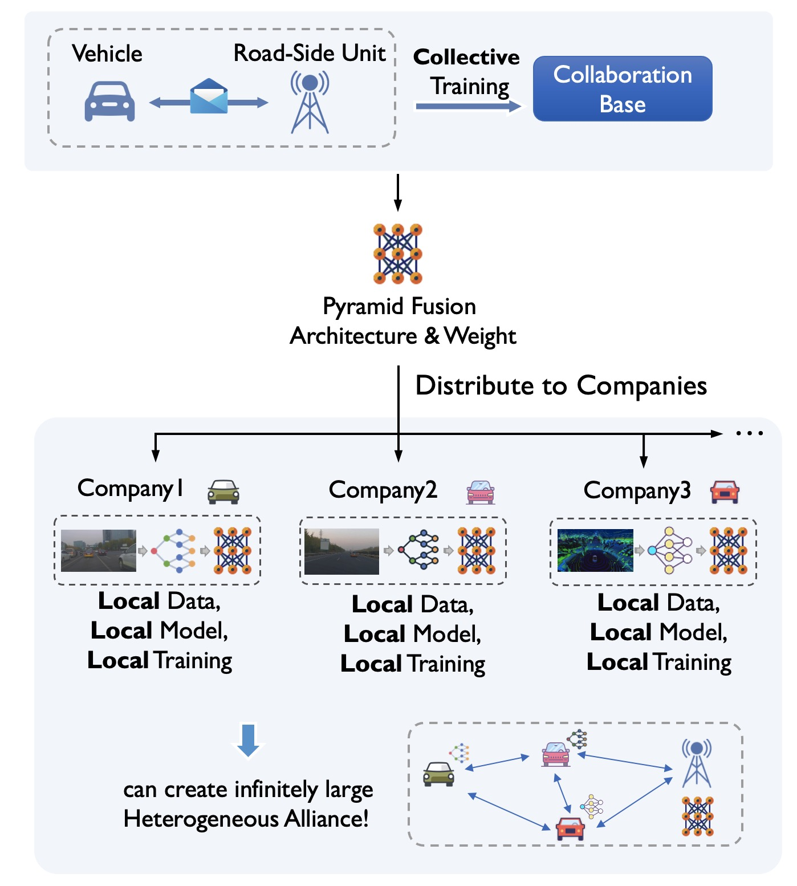

# GenComm (**Gen**erative **Comm**unication mechanism)
### [NeurIPS 2025] Pragmatic Heterogeneous Collaborative Perception via Generative Communication Mechanism
[Junfei Zhou](https://github.com/jeffreychou777), [Penglin Dai](https://itsgroups.github.io/)✉, [Quanmin Wei](https://github.com/fengxueguiren), Bingyi Liu,Xiao Wu, Jianping Wang


[Homepage]() | [ArXiv]() | [Zhihu]()


This repository provides a unified and integrated multi-agent collaborative perception framework, extended from [**HELA**]() to support heterogeneous settings across sensors, modalities, and models.
Building on [**HELA**](), we add support for additional features, datasets, and multiple heterogeneous collaboration methods.
Explore this repository to discover the ultimate experience of heterogeneous collaboration.🌟




## Repo Features

### Inherit from [HEAL](https://github.com/yifanlu0227/HEAL)
- Modality Support: LiDAR/Camera/LiDAR + Camera

- Heterogeneity Support: Sensor/Modality/Model

- Dataset Support: OPV2V/V2XSet/V2X-Sim 2.0/DAIR-V2X-C

- Detector Support: PointPillars/SECOND/Pixor/VoxelNet/Lift-Splat-Shoot

- Multiple collaborative perception methods
  - [x] [Attentive Fusion [ICRA2022]](https://arxiv.org/abs/2109.07644)
  - [x] [Cooper [ICDCS]](https://arxiv.org/abs/1905.05265)
  - [x] [F-Cooper [SEC2019]](https://arxiv.org/abs/1909.06459)
  - [x] [V2VNet [ECCV2022]](https://arxiv.org/abs/2008.07519)
  - [x] [DiscoNet [NeurIPS2022]](https://arxiv.org/abs/2111.00643)
  - [x] [V2X-ViT [ECCV2022]](https://github.com/DerrickXuNu/v2x-vit)
  - [x] [CoAlign [ICRA2023]](https://arxiv.org/abs/2211.07214)
  - [x] [HEAL [ICLR2024]](https://openreview.net/forum?id=KkrDUGIASk)

- Robustness Setiing
  - [x] Pose error

### What's more: 🌟

- Multiple heterogeneous collaboration methods
  - [x] [MPDA [ICRA 2023]]()
  - [x] [BackAlign [ICLR 2024]]()
  - [x] [CodeFilling [CVPR 2025]]()
  - [x] [STAMP [ICLR 2025]]()
  - [x] [GenComm [NeurIPS 2025]]()

- Additional Dataset Support
  - [x] [V2X-Real(Real-World dataset with 4 agent, 2CAV & 2RSU) [ECCV 2024]]()

- Robustness Settings
  - [x] Communication delay
  - [x] Communication degradation
  - [x] LiDAR Simulation under snow and foggy weather

## Data Preparation
- OPV2V: Please refer to [this repo](https://github.com/DerrickXuNu/OpenCOOD). You also need to download `additional-001.zip` which stores data for camera modality.
- OPV2V-H: We store our data in [Huggingface Hub](https://huggingface.co/datasets/yifanlu/OPV2V-H). Please refer to [Downloading datasets](https://huggingface.co/docs/hub/datasets-downloading) tutorial for the usage.
- V2XSet: Please refer to [this repo](https://github.com/DerrickXuNu/v2x-vit).
- V2X-Sim 2.0: Download the data from [this page](https://ai4ce.github.io/V2X-Sim/). Also download pickle files from [google drive](https://drive.google.com/drive/folders/16_KkyjV9gVFxvj2YDCzQm1s9bVTwI0Fw?usp=sharing).
- DAIR-V2X-C: Download the data from [this page](https://thudair.baai.ac.cn/index). We use complemented annotation, so please also follow the instruction of [this page](https://siheng-chen.github.io/dataset/dair-v2x-c-complemented/). 

Note that you can select your interested dataset to download. **OPV2V**, **OPV2V**, **DAIR-V2X-C** and **V2X-Real** are used in our experiments, so it is recommended that you download and try them first. 

Create a `dataset` folder under `GenComm` and put your data there. Make the naming and structure consistent with the following:
```
GenComm/dataset

. 
├── my_dair_v2x 
│   ├── v2x_c
│   ├── v2x_i
│   └── v2x_v
├── OPV2V
│   ├── additional
│   ├── test
│   ├── train
│   └── validate
├── OPV2V_Hetero
│   ├── test
│   ├── train
│   └── validate
├── V2XSET
│   ├── test
│   ├── train
│   └── validate
├── v2xsim2-complete
│   ├── lidarseg
│   ├── maps
│   ├── sweeps
│   └── v1.0-mini
└── v2xsim2_info
    ├── v2xsim_infos_test.pkl
    ├── v2xsim_infos_train.pkl
    └── v2xsim_infos_val.pkl
```


## Installation
```bash
# create env
conda create -n gencomm python=3.8
conda activate gencomm
# install pytorch. 
conda install pytorch==1.12.1 torchvision==0.13.1 torchaudio==0.12.1 cudatoolkit=11.6 -c pytorch -c conda-forge
# install dependency
pip install -r requirements.txt # -i https://pypi.tuna.tsinghua.edu.cn/simple use this mirror if needed

# install this project. It's OK if EasyInstallDeprecationWarning shows up.
python setup.py develop

pip install spconv-cu116 # match your cudatoolkit version
python opencood/utils/setup.py build_ext --inplace

# OPTINAL, in this repo, you can skip following command
python opencood/pcdet_utils/setup.py build_ext --inplace
```

> **Note:** By default, this repo uses **spconv 2.x**.  
> If you want to reproduce the checkpoints from the [HEAL]() repo, you may encounter some bugs, especially when the LiDAR encoder is **SECOND**.  
> In that case, please refer to the [HEAL]() repo to install **spconv 1.2.1**.
 

## Basic Train / Test Command
We follow the style of basic training and tesitng command of OpenCOOD and HEAL. These training and testing instructions apply to all end-to-end training methods. 

### Train the model
We uses yaml file to configure all the parameters for training. To train your own model
from scratch or a continued checkpoint, run the following commonds:
```python
python opencood/tools/train.py -y ${CONFIG_FILE} [--model_dir ${CHECKPOINT_FOLDER}]
```
Arguments Explanation:
- `-y` or `hypes_yaml` : the path of the training configuration file, e.g. `opencood/hypes_yaml/opv2v/LiDAROnly/lidar_fcooper.yaml`, meaning you want to train
a FCooper model. **We elaborate each entry of the yaml in the exemplar config file `opencood/hypes_yaml/exemplar.yaml`.**
- `model_dir` (optional) : the path of the checkpoints. This is used to fine-tune or continue-training. When the `model_dir` is
given, the trainer will discard the `hypes_yaml` and load the `config.yaml` in the checkpoint folder. In this case, ${CONFIG_FILE} can be `None`,

### Train the model in DDP
```python
CUDA_VISIBLE_DEVICES=0,1 python -m torch.distributed.launch  --nproc_per_node=2 --use_env opencood/tools/train_ddp.py -y ${CONFIG_FILE} [--model_dir ${CHECKPOINT_FOLDER}]
```
`--nproc_per_node` indicate the GPU number you will use.

### Test the model
```python
python opencood/tools/inference.py --model_dir ${CHECKPOINT_FOLDER} [--fusion_method intermediate]
```
- `inference.py` has more optional args, you can inspect into this file.
- `[--fusion_method intermediate]` the default fusion method is intermediate fusion. According to your fusion strategy in training, available fusion_method can be:
  - **single**: only ego agent's detection, only ego's gt box. *[only for late fusion dataset]*
  - **no**: only ego agent's detection, all agents' fused gt box.  *[only for late fusion dataset]*
  - **late**: late fusion detection from all agents, all agents' fused gt box.  *[only for late fusion dataset]*
  - **early**: early fusion detection from all agents, all agents' fused gt box. *[only for early fusion dataset]*
  - **intermediate**: intermediate fusion detection from all agents, all agents' fused gt box. *[only for intermediate fusion dataset]*

## Yaml Style & Yaml Zoo

We introduced identifiers such as `m1`, `m2`, ... to indicate the modalities and models that an agent will use.  

However, yaml files without identifiers like `m1` (if you are familiar with the [CoAlign](https://github.com/yifanlu0227/CoAlign) repository) still work in this repository. For example, [PointPillar Early Fusion](https://github.com/yifanlu0227/CoAlign/blob/main/opencood/hypes_yaml/opv2v/lidar_only_with_noise/pointpillar_early.yaml). 

Note that there will be some differences in the weight key names of their two models' checkpoint. For example, training with the `m1` identifier will assign some parameters's name with prefix like `encoder_m1.`, `backbone_m1`, etc. But since the model structures are the same, you can convert them using the `rename_model_dict_keys` function in `opencood/utils/model_utils.py`.

### Agent type identifier

- The identifiers like `m1, m2` in `opv2v_4modality.json`  are used to assign agent type to each agent in the scene. With this assignment, we ensure the validation scenarios for all methods are consistent and fixed. To generate these json files, you can refer to [heter_utils.py](https://github.com/yifanlu0227/HEAL/blob/2fd71de77dada46ded8345aeb68026ce2346c214/opencood/utils/heter_utils.py#L96).

- The identifiers like `m1, m2` in `${METHOD}.yaml` are used to specify the sensor configuration and detection model used by this agent type (like `m2` in the case of `camera_pyramid.yaml`). 

In `${METHOD}.yaml`, there is also a concept of `mapping_dict`. It maps the given agent type of `opv2v_4modality.json` to the agent type in the current experiment. As you can see, `camera_pyramid.yaml` is a homogeneous collaborative perception setting, so the type of all agents should be the same, which can be referred to by `m2`.

Just note that `mapping_dict` will not take effect during the training process to introduce more data augmentation. Each agent will be randomly assigned an agent type that exists in the yaml.


## Training of Baselines
<!-- <div align="center">

</div> -->

HEAL will first train a collaboration base and then align new agent type to this base. Follows our paper, we select LiDAR w/ PointPillars as our collaboration base.
### Step 1: Train the Collaboration Base
Suppose you are now in the `HEAL/` folder. If this is your first training attempt, execute `mkdir opencood/logs`. Then 

```bash
mkdir opencood/logs/HEAL_m1_based
mkdir opencood/logs/HEAL_m1_based/stage1
mkdir opencood/logs/HEAL_m1_based/stage1/m1_base

cp opencood/hypes_yaml/opv2v/MoreModality/HEAL/stage1/m1_pyramid.yaml opencood/logs/HEAL_m1_based/stage1/m1_base/config.yaml
python opencood/tools/train.py -y None --model_dir opencood/logs/HEAL_m1_based/stage1/m1_base # you can also use DDP training
```
### Step 2: Train New Agent Types
After the collaboration base training, you probably get a best-validation checkpoint. For example, "net_epoch_bestval_at23.pth". Then we use and fix the parameters of Pyramid Fusion in "net_epoch_bestval_at23.pth" for new agent type training.

```bash
mkdir opencood/logs/HEAL_m1_based/stage2
mkdir opencood/logs/HEAL_m1_based/stage2/m2_alignto_m1
mkdir opencood/logs/HEAL_m1_based/stage2/m3_alignto_m1
mkdir opencood/logs/HEAL_m1_based/stage2/m4_alignto_m1

cp opencood/logs/HEAL_m1_based/stage1/m1_base/net_epoch_bestval_at23.pth opencood/logs/HEAL_m1_based/stage2/net_epoch1.pth # your bestval checkpoint!

ln -s opencood/logs/HEAL_m1_based/stage2/net_epoch1.pth opencood/logs/HEAL_m1_based/stage2/m2_alignto_m1
ln -s opencood/logs/HEAL_m1_based/stage2/net_epoch1.pth opencood/logs/HEAL_m1_based/stage2/m3_alignto_m1
ln -s opencood/logs/HEAL_m1_based/stage2/net_epoch1.pth opencood/logs/HEAL_m1_based/stage2/m4_alignto_m1

cp opencood/hypes_yaml/opv2v/MoreModality/HEAL/stage2/m2_single_pyramid.yaml opencood/logs/HEAL_m1_based/stage2/m2_alignto_m1/config.yaml
cp opencood/hypes_yaml/opv2v/MoreModality/HEAL/stage2/m3_single_pyramid.yaml opencood/logs/HEAL_m1_based/stage2/m3_alignto_m1/config.yaml
cp opencood/hypes_yaml/opv2v/MoreModality/HEAL/stage2/m4_single_pyramid.yaml opencood/logs/HEAL_m1_based/stage2/m4_alignto_m1/config.yaml
```

Then you can train new agent type without collaboration. These models can be trained in parallel.
```bash
python opencood/tools/train.py -y None --model_dir opencood/logs/HEAL_m1_based/stage2/m2_alignto_m1 # you can also use DDP training
python opencood/tools/train.py -y None --model_dir opencood/logs/HEAL_m1_based/stage2/m3_alignto_m1
python opencood/tools/train.py -y None --model_dir opencood/logs/HEAL_m1_based/stage2/m4_alignto_m1
```

### Step 3: Combine and Infer
```bash
mkdir opencood/logs/HEAL_m1_based/final_infer/ # create a log folder for final infer.

cp opencood/hypes_yaml/opv2v/MoreModality/HEAL/final_infer/m1m2m3m4.yaml opencood/logs/HEAL_m1_based/final_infer/config.yaml 

python opencood/tools/heal_tools.py merge_final \
  opencood/logs/HEAL_m1_based/stage2/m2_alignto_m1 \
  opencood/logs/HEAL_m1_based/stage2/m3_alignto_m1 \
  opencood/logs/HEAL_m1_based/stage2/m4_alignto_m1 \
  opencood/logs/HEAL_m1_based/stage1/m1_base \
  opencood/logs/HEAL_m1_based/final_infer
```
`python opencood/tools/heal_tools.py merge_final` will automatically search the best checkpoints for each folder and merge them together. The collaboration base's folder (m1 here) should be put in the second to last place, while the output folder should be put last.

To validate the HEAL's performance in open heterogeneous setting, i.e., gradually adding new agent types into the scene, we use `opencood/tools/inference_heter_in_order.py`.

```bash
python opencood/tools/inference_heter_in_order.py --model_dir opencood/logs/HEAL_m1_based/final_infer 
```
This will overwrite many parameters in `config.yaml`, including `mapping_dict`, `comm_range`, and gradually adding m1, m2, m3, m4 agent into the scene. Ground-truth will always be `max_cav`'s fused gt boxes.

## Training of GenComm

## Real-World Practice Rationale
Take the DAIR-V2X dataset as an example, which consists of one vehicle and one Road-side Unit(RSU). We first trained the Pyramid Fusion using the vehicle and the RSU’s data as the collaboration base. Subsequently, we distributed the vehicle’s raw data and the Pyramid Fusion’s weights to various companies, allowing them to train their respective models locally.
<!-- <div align="center">

</div> -->

## Benchmark Checkpoints
We store our checkpoints files in [HEAL's Huggingface Hub](https://huggingface.co/yifanlu/HEAL/tree/main).

Update: Those checkpoints has a faulty input channel number for SECOND related models, but you can still run them with spconv 1.2.1 (because spconv 1.2.1 has no sanity check). The performance should degrade but it still looks reasonable. More discussion can be found in [Issue 20](https://github.com/yifanlu0227/HEAL/issues/20). 

If you want to compare with HEAL's model and you use spconv 1.2.1, you can still load from the checkpoint. To develop your model, please do not use these checkpoints.

## Citation
```
Coming soon
```

## Acknowledge
This repo is built on these fantastic repos: [OpenCOOD](https://github.com/DerrickXuNu/OpenCOOD), [HEAL](https://github.com/yifanlu0227/HEAL), and [V2X-R](https://github.com/ylwhxht/V2X-R).
Thanks for your great contribution for this community.[@yifanlu0227](https://github.com/yifanlu0227), [@DerrickXuNu](https://github.com/DerrickXuNu) and [@ylwhxht](https://github.com/ylwhxht)

