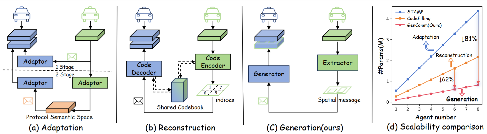
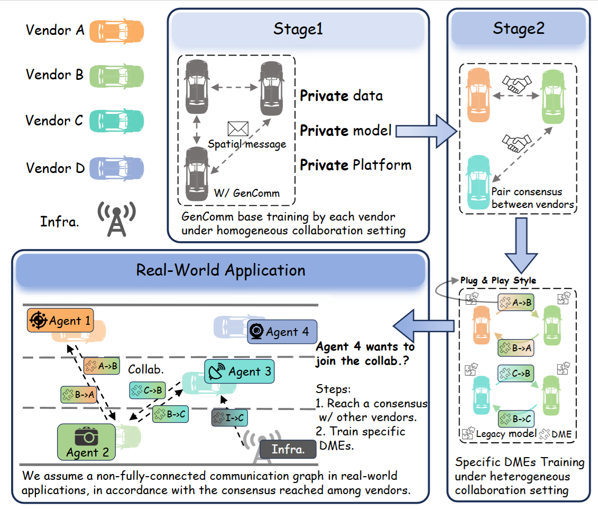

# GenComm (**Gen**erative **Comm**unication)
### [NeurIPS 2025] Pragmatic Heterogeneous Collaborative Perception via Generative Communication Mechanism
[Junfei Zhou](https://jeffreychou777.github.io/), [Penglin Dai](https://itsgroups.github.io/)✉, [Quanmin Wei](https://github.com/fengxueguiren), [Bingyi Liu](http://cst.whut.edu.cn/xygk/szdw/201809/t20180911_876964.shtml), [Xiao Wu](https://faculty.swjtu.edu.cn/wuxiao1/zh_CN/index.htm), [Jianping Wang](https://scholars.cityu.edu.hk/en/persons/jianwang)


[Homepage](https://jeffreychou777.github.io/GenComm/) | [ArXiv](https://arxiv.org/pdf/2510.19618) | [Poster](images/poster.png)


This repository provides a unified and integrated multi-agent collaborative perception framework, extended from [**HEAL**](https://github.com/yifanlu0227/HEAL) to support heterogeneous settings across sensors, modalities, and models.
Building on [**HEAL**](https://github.com/yifanlu0227/HEAL), we add support for additional features, datasets, and multiple heterogeneous collaboration methods.
Explore this repository to discover the ultimate experience of heterogeneous collaboration.🌟




## Repo Features

### Inherit from [HEAL](https://github.com/yifanlu0227/HEAL)
- Modality Support: LiDAR/Camera/LiDAR + Camera

- Heterogeneity Support: Sensor/Modality/Model

- Dataset Support: OPV2V/V2XSet/V2X-Sim 2.0/DAIR-V2X-C

- Detector Support: PointPillars/SECOND/Pixor/VoxelNet/Lift-Splat-Shoot

- Multiple collaborative perception methods
  - [x] [Attentive Fusion [ICRA2022]](https://arxiv.org/abs/2109.07644)
  - [x] [Cooper [ICDCS]](https://arxiv.org/abs/1905.05265)
  - [x] [F-Cooper [SEC2019]](https://arxiv.org/abs/1909.06459)
  - [x] [V2VNet [ECCV2022]](https://arxiv.org/abs/2008.07519)
  - [x] [DiscoNet [NeurIPS2022]](https://arxiv.org/abs/2111.00643)
  - [x] [V2X-ViT [ECCV2022]](https://github.com/DerrickXuNu/v2x-vit)
  - [x] [CoAlign [ICRA2023]](https://arxiv.org/abs/2211.07214)
  - [x] [HEAL [ICLR2024]](https://openreview.net/forum?id=KkrDUGIASk)

- Robustness Setiing
  - [x] Pose error

### What's new 🌟

- Multiple heterogeneous collaboration methods
  - [x] [MPDA [ICRA 2023]](https://arxiv.org/pdf/2210.08451)
  - [x] [BackAlign | HEAL [ICLR 2024]](https://openreview.net/forum?id=KkrDUGIASk)
  - [x] [CodeFilling [CVPR 2024]](https://openaccess.thecvf.com/content/CVPR2024/papers/Hu_Communication-Efficient_Collaborative_Perception_via_Information_Filling_with_Codebook_CVPR_2024_paper.pdf)
  - [x] [STAMP [ICLR 2025]](https://arxiv.org/pdf/2501.18616)
  - [x] [GenComm [NeurIPS 2025]]()

- Additional Dataset Support
  - [x] [V2X-Real [ECCV 2024]](https://github.com/ucla-mobility/V2X-Real) (Real-World dataset with 4 agents, 2CAV & 2RSU)
  - [ ] [V2V4REAL [CVPR 2023]](https://github.com/ucla-mobility/V2V4Real) (Real-world dataset with 2 agents, 1CAV & 1RSU)
- Robustness Settings
  - [x] Communication delay
  - [x] Communication degradation
  - [ ] LiDAR Simulation under snow and foggy weather

- Two variants of AP computation, See details [here](https://github.com/DerrickXuNu/OpenCOOD/issues/104)

## Data Preparation
You can refer to the information from [HEAL](https://github.com/yifanlu0227/HEAL):
>- OPV2V: Please refer to [this repo](https://github.com/DerrickXuNu/OpenCOOD). You also need to download `additional-001.zip` which stores data for camera modality.
>- OPV2V-H: We store our data in [Huggingface Hub](https://huggingface.co/datasets/yifanlu/OPV2V-H). Please refer to [Downloading datasets](https://huggingface.co/docs/hub/datasets-downloading) tutorial for the usage.
>- V2XSet: Please refer to [this repo](https://github.com/DerrickXuNu/v2x-vit).
>- V2X-Sim 2.0: Download the data from [this page](https://ai4ce.github.io/V2X-Sim/). Also download pickle files from [google drive](https://drive.google.com/drive/folders/16_KkyjV9gVFxvj2YDCzQm1s9bVTwI0Fw?usp=sharing).
>- DAIR-V2X-C: Download the data from [this page](https://thudair.baai.ac.cn/index). We use complemented annotation, so please also follow the instruction of [this page](https://siheng-chen.github.io/dataset/dair-v2x-c-complemented/). 

Note that you can select your interested dataset to download.**OPV2V-H**, **DAIR-V2X-C** and **V2X-Real** are used in our experiments, so it is recommended that you download and try them first. 

Create a `dataset` folder under `GenComm` and put your data there. Make the naming and structure consistent with the following:
```
GenComm/dataset

. 
├── my_dair_v2x 
│   ├── v2x_c
│   ├── v2x_i
│   └── v2x_v
├── OPV2V
│   ├── additional
│   ├── test
│   ├── train
│   └── validate
├── OPV2V_Hetero
│   ├── test
│   ├── train
│   └── validate
├── V2XSET
│   ├── test
│   ├── train
│   └── validate
├── v2xsim2-complete
│   ├── lidarseg
│   ├── maps
│   ├── sweeps
│   └── v1.0-mini
└── v2xsim2_info
    ├── v2xsim_infos_test.pkl
    ├── v2xsim_infos_train.pkl
    └── v2xsim_infos_val.pkl
```


## Installation
```bash
# create env
conda create -n gencomm python=3.8
conda activate gencomm
# install pytorch. 
conda install pytorch==1.12.1 torchvision==0.13.1 torchaudio==0.12.1 cudatoolkit=11.6 -c pytorch -c conda-forge
# install dependency
pip install -r requirements.txt # -i https://pypi.tuna.tsinghua.edu.cn/simple use this mirror if needed

# install this project. It's OK if EasyInstallDeprecationWarning shows up.
python setup.py develop

pip install spconv-cu116 # match your cudatoolkit version
python opencood/utils/setup.py build_ext --inplace

# OPTINAL, in this repo, you can skip following command
python opencood/pcdet_utils/setup.py build_ext --inplace
```

> **Note:** By default, this repo uses **spconv 2.x**.  
> If you want to reproduce the checkpoints from the [HEAL](https://github.com/yifanlu0227/HEAL) repo, you may encounter some bugs, especially when the LiDAR encoder is **SECOND**.  
> In that case, please refer to the [HEAL]() repo to install **spconv 1.2.1**.


## Yaml Style

Following [HEAL](https://github.com/yifanlu0227/HEAL), We use identifiers such as `m1`, `m2`, ... to indicate the modalities and models that an agent will use.  

However, yaml files without identifiers like `m1` (if you are familiar with the [CoAlign](https://github.com/yifanlu0227/CoAlign) repository) still work in this repository. For example, [PointPillar Early Fusion](https://github.com/yifanlu0227/CoAlign/blob/main/opencood/hypes_yaml/opv2v/lidar_only_with_noise/pointpillar_early.yaml). 

Note that there will be some differences in the weight key names of their two models' checkpoint. For example, training with the `m1` identifier will assign some parameters's name with prefix like `encoder_m1.`, `backbone_m1`, etc. But since the model structures are the same, you can convert them using the `rename_model_dict_keys` function in `opencood/utils/model_utils.py`.

### Agent type identifier

- The identifiers like `m1, m2` in `opv2v_4modality.json`  are used to assign agent type to each agent in the scene. With this assignment, we ensure the validation scenarios for all methods are consistent and fixed. To generate these json files, you can refer to [heter_utils.py](https://github.com/yifanlu0227/HEAL/blob/2fd71de77dada46ded8345aeb68026ce2346c214/opencood/utils/heter_utils.py#L96).

- The identifiers like `m1, m2` in `${METHOD}.yaml` are used to specify the sensor configuration and detection model used by this agent type (like `m2` in the case of `camera_pyramid.yaml`). 

In `${METHOD}.yaml`, there is also a concept of `mapping_dict`. It maps the given agent type of `opv2v_4modality.json` to the agent type in the current experiment. If all agent types in the mapping_dict are mapped to the same category, the setting is considered a homogeneous collaborative perception scenario.

Just note that `mapping_dict` will not take effect during the training process to introduce more data augmentation. Each agent will be randomly assigned an agent type that exists in the yaml.

## Basic Train / Test Command
We follow the style of basic training and tesitng command of [OpenCOOD](https://github.com/DerrickXuNu/OpenCOOD) and [HEAL](https://github.com/yifanlu0227/HEAL). These training and testing instructions apply to all end-to-end training methods. 

### Train the model
We uses yaml file to configure all the parameters for training. To train your own model
from scratch or a continued checkpoint, run the following commonds:
```python
python opencood/tools/train.py -y ${CONFIG_FILE} [--model_dir ${CHECKPOINT_FOLDER}]
```
Arguments Explanation:
- `-y` or `hypes_yaml` : the path of the training configuration file, e.g. `opencood/hypes_yaml/opv2v/LiDAROnly/lidar_fcooper.yaml`, meaning you want to train
a FCooper model. **We elaborate each entry of the yaml in the exemplar config file `opencood/hypes_yaml/exemplar.yaml`.**
- `model_dir` (optional) : the path of the checkpoints. This is used to fine-tune or continue-training. When the `model_dir` is
given, the trainer will discard the `hypes_yaml` and load the `config.yaml` in the checkpoint folder. In this case, ${CONFIG_FILE} can be `None`,

### Train the model in DDP
```python
CUDA_VISIBLE_DEVICES=0,1 python -m torch.distributed.launch  --nproc_per_node=2 --use_env opencood/tools/train_ddp.py -y ${CONFIG_FILE} [--model_dir ${CHECKPOINT_FOLDER}]
```
`--nproc_per_node` indicate the GPU number you will use.

### Test the model
```python
python opencood/tools/inference.py --model_dir ${CHECKPOINT_FOLDER} [--fusion_method intermediate]
```
- `inference.py` has more optional args, you can inspect into this file.
- `[--fusion_method intermediate]` the default fusion method is intermediate fusion. According to your fusion strategy in training, available fusion_method can be:
  - **single**: only ego agent's detection, only ego's gt box. *[only for late fusion dataset]*
  - **no**: only ego agent's detection, all agents' fused gt box.  *[only for late fusion dataset]*
  - **late**: late fusion detection from all agents, all agents' fused gt box.  *[only for late fusion dataset]*
  - **early**: early fusion detection from all agents, all agents' fused gt box. *[only for early fusion dataset]*
  - **intermediate**: intermediate fusion detection from all agents, all agents' fused gt box. *[only for intermediate fusion dataset]*


## Training and inference of Baselines
<!-- <div align="center">

</div> -->

All the baselines adopt a two-stage training strategy: first, training the collaborative base in a homogeneous setting for each agent type, and then training the baseline methods in a heterogeneous setting with different agent types.

### Stage 1: Train the Collaboration Base
Suppose you are now in the `GenComm/` folder. If this is your first training attempt, execute `mkdir opencood/logs`. Then 

```bash
mkdir opencood/logs/Baselines
mkdir opencood/logs/Baselines/stage1
mkdir opencood/logs/Baselines/stage1/OPV2V_m1_att

cp opencood/hypes_yaml/opv2v/GenComm_yamls/baselines/stage1/m1_att.yaml opencood/logs/Baselines/stage1/OPV2V_m1_att/config.yaml

CUDA_VISIBLE_DEVICES=x python opencood/tools/train.py -y None --model_dir opencood/logs/Baselines/stage1/OPV2V_m1_att/  # x is the index of GPUs

# you can also use DDP training:

CUDA_VISIBLE_DEVICES=0,1 python -m torch.distributed.launch  --nproc_per_node=2 --use_env opencood/tools/train_ddp.py -y None --model_dir opencood/logs/Baselines/stage1/OPV2V_m1_att/ # PLEASE make sure that the num of nproc_per_node equal to the num of GPUs.
```
### Stage 2: Train New Agent Types
After the collaboration base training, you will obtain the best-validation checkpoint for each agent type (e.g., net_epoch_bestval_at17.pth).
Now, in the heterogeneous collaboration stage:
-	For CodeFilling and MPDA, when a new agent joins the collaboration, the entire module needs to be retrained. For example, we need to train combinations such as `m1m2`, `m1m2m3`, and `m1m2m3m4`.
- For BackAlign, when a new agent joins the collaboration, only the new agent’s encoder needs to be retrained. We train `m1m2`, `m1m3`, and `m1m4`.
- For STAMP, when a new agent joins the collaboration, its adapter and reverter to the protocol space need to be trained. We train `m0m1`, `m0m2`, `m0m3`, and `m0m4`.

```bash
## CodeFilling & MPDA style
mkdir opencood/logs/Baselines/stage2/CodeFilling/OPV2V_m1m2_att
mkdir opencood/logs/Baselines/stage2/CodeFilling/OPV2V_m1m2m3_att
mkdir opencood/logs/Baselines/stage2/CodeFilling/OPV2V_m1m2m3m4_att

# Take m1m2m3 as an example

# copy config.yaml
cp opencood/hypes_yaml/opv2v/GenComm_yamls/baselines/stage2/CodeFilling/OPV2V_m1m2m3_att.yaml opencood/logs/Baselines/stage2/CodeFilling/OPV2V_m1m2m3_att/config.yaml

# combine ckpt form stage1
python opencood/tools/heal_tools.py merge_and_save \
  opencood/logs/Baselines/stage1/OPV2V_m2_att \
  opencood/logs/Baselines/stage1/OPV2V_m3_att \
  opencood/logs/Baselines/stage1/OPV2V_m1_att \
  opencood/logs/Baselines/stage2/CodeFilling/OPV2V_m1m2m3_att

# `python opencood/tools/heal_tools.py merge_and_save` will automatically search the best checkpoints for each folder and merge them together. The collaboration base's folder (m1 here) should be put in the second to last place, while the output folder should be put last.

# Then you can train new agent type as below:
```bash
python opencood/tools/train.py -y None --model_dir opencood/logs/Baselines/stage2/CodeFilling/OPV2V_m1m2m3_att # you can also use DDP training

## BackAlign & STAMP style
mkdir opencood/logs/Baselines/stage2/BackAlign/OPV2V_m1m2_att
mkdir opencood/logs/Baselines/stage2/BackAlign/OPV2V_m1m3_att
mkdir opencood/logs/Baselines/stage2/BackAlign/OPV2V_m1m4_att

# Take m1m3 as an example 
# copy config.yaml
cp opencood/hypes_yaml/opv2v/GenComm_yamls/baselines/stage2/BackAlign/m1m3_att.yaml opencood/logs/Baselines/stage2/BackAlign/OPV2V_m1m3_att/config.yaml

# combine ckpt form stage1
python opencood/tools/heal_tools.py merge_and_save \
  opencood/logs/Baselines/stage1/OPV2V_m3_att \
  opencood/logs/Baselines/stage1/OPV2V_m1_att \
  opencood/logs/Baselines/stage2/BackAlign/OPV2V_m1m3_att

# Make sure that ego_dir is placed as the second-to-last argument, and the directory for saving the combined checkpoint is placed as the last argument.

# Then you can train new agent type as below:
```bash
python opencood/tools/train.py -y None --model_dir opencood/logs/Baselines/stage2/BackAlign/OPV2V_m1m3_att # you can also use DDP training


```

### Stage 3: Inference
At the inference stage, we consider two scenarios in our paper: static and dynamic.
- The static inference scenario usually includes two agent types, e.g., `m1m2`.
- The dynamic inference scenario refers to dynamically adding new agent types into the collaboration.

#### For static inference
```bash
# you can directly inference in any log_dir of stage2
CUDA_VISIBLE_DEVICES=x python opencood/tools/inference.py --model_dir opencood/logs/Baselines/stage2/BackAlign/OPV2V_m1m3_att
```
#### For dynamic inference
- CodeFilling & MPDA. Use `opencood/tools/inference_heter_in_order.py` in the `m1m2m3m4` log_dir of stage2
```bash
CUDA_VISIBLE_DEVICES=x opencood/tools/inference_heter_in_order.py --model_dir opencood/logs/Baselines/stage2/CodeFilling/OPV2V_m1m2m3m4_att --use_cav [2,3,4]
```
- BackAlign & STAMP. You need to first combine the four checkpoints from Stage 2, and then perform inference.

```bash
mkdir opencood/logs/BackAlign/stage2/OPV2V_m1m2m3m4_att_infer/ # create a log folder for final infer.

cp opencood/hypes_yaml/opv2v/GenComm_yamls/baselines/stage2/BackAlign/m1m2m3m4_att_infer.yaml opencood/logs/BackAlign/OPV2V_m1m2m3m4_infer/

python opencood/tools/heal_tools.py merge_and_save \
  opencood/logs/Baselines/stage2/BackAlign/OPV2V_m1m2_att \
  opencood/logs/Baselines/stage2/BackAlign/OPV2V_m1m3_att \
  opencood/logs/Baselines/stage2/BackAlign/OPV2V_m1m4_att \
  opencood/logs/Baselines/stage2/OPV2V_m1_att \
  opencood/logs/Baselines/stage2/OPV2V_m1m2m3m4_att_infer

python opencood/tools/inference_heter_in_order.py --model_dir opencood/logs/HEAL_m1_based/final_infer 
```

This will overwrite many parameters in `config.yaml`, including `mapping_dict`, `comm_range`, and gradually adding m1, m2, m3, m4 agent into the scene. Ground-truth will always be `max_cav`'s fused gt boxes.

## Training and inference of GenComm
### Stage 1: Base training of GenComm
```bash
mkdir opencood/logs/GenComm/stage1/OPV2V_m1_att
mkdir opencood/logs/GenComm/stage1/OPV2V_m2_att
mkdir opencood/logs/GenComm/stage1/OPV2V_m3_att
mkdir opencood/logs/GenComm/stage1/OPV2V_m4_att

# Take m1 as an example
# copy the config.yaml
cp opencood/hypes_yaml/opv2v/GenComm_yamls/gencomm/stage1/m1_att_diffcomm.yaml opencood/logs/GenComm/stage1/OPV2V_m1_att/config.yaml

# Train
CUDA_VISIBLE_DEVICES=x python opencood/tools/trian.py -y None --model_dir opencood/logs/GenComm/stage1/OPV2V_m1_att
```


### Stage 2: Heterogenous Collaboration
```bash
mkdir opencood/logs/GenComm/stage2/OPV2V_m1m2_att
mkdir opencood/logs/GenComm/stage2/OPV2V_m1m3_att
mkdir opencood/logs/GenComm/stage2/OPV2V_m1m4_att

# Take m1m2 as an example
cp opencood/hypes_yaml/opv2v/GenComm_yamls/gencomm/stage2/m1m2_att.yaml opencood/logs/GenComm/stage2/OPV2V_m1m2_att/config.yaml

python opencood/tools/heal_tools.py merge_and_save \
  opencood/logs/GenComm/stage1/OPV2V_m2_att \
  opencood/logs/GenComm/stage1/OPV2V_m1_att \
  opencood/logs/GenComm/stage2/OPV2V_m1m2_att
```
### Stage3: Inference stage
Refer to the inference style of BackAlign above.

> Attention: There are specific training and inference scripts for certain datasets and methods, such as `train_stamp.py`, `inference_v2xreal.py`, and `inference_v2xreal_heter_in_order.py`. Please make sure to use the corresponding script accordingly.

## Real-World Practice Rationale
- Stage1: GenComm base training under homogeneous collaboration
- Stage2: Specific Deformable Message Extractors training under heterogeneous collaboration
- New agents join the collaboration by reaching a consensus with other vendors and training specific DMEs.


<div align="center">

</div>

<!-- ## Benchmark Checkpoints
We store our checkpoints files in [HEAL's Huggingface Hub](https://huggingface.co/yifanlu/HEAL/tree/main).

Update: Those checkpoints has a faulty input channel number for SECOND related models, but you can still run them with spconv 1.2.1 (because spconv 1.2.1 has no sanity check). The performance should degrade but it still looks reasonable. More discussion can be found in [Issue 20](https://github.com/yifanlu0227/HEAL/issues/20). 

If you want to compare with HEAL's model and you use spconv 1.2.1, you can still load from the checkpoint. To develop your model, please do not use these checkpoints. -->

## Citation
```
@article{zhou2025pragmatic,
  title={Pragmatic Heterogeneous Collaborative Perception via Generative Communication Mechanism},
  author={Zhou, Junfei and Dai, Penglin and Wei, Quanmin and Liu, Bingyi and Wu, Xiao and Wang, Jianping},
  journal={arXiv preprint arXiv:2510.19618},
  year={2025}
}
```

## Acknowledge
This repository is built upon the excellent foundations of [OpenCOOD](https://github.com/DerrickXuNu/OpenCOOD), [HEAL](https://github.com/yifanlu0227/HEAL), and [V2X-R](https://github.com/ylwhxht/V2X-R).
We sincerely appreciate [@yifanlu0227](https://github.com/yifanlu0227), [@DerrickXuNu](https://github.com/DerrickXuNu) and [@ylwhxht](https://github.com/ylwhxht)
for their outstanding contributions to the community.
